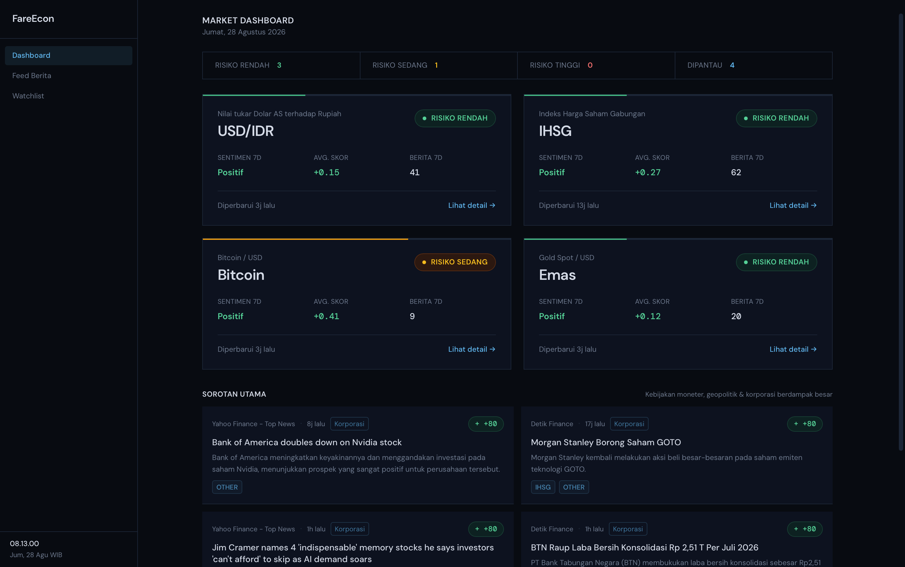

# FareEcon

Dashboard pemantau ekonomi yang menampilkan kondisi pasar global dan dampaknya
ke Indonesia — nilai tukar rupiah, IHSG, crypto, emas, dan saham AS pilihan —
lengkap dengan ringkasan berita dan skor sentimen yang dihasilkan otomatis
lewat AI.



## Fitur

- Dashboard ringkasan berisi level risiko dan sentimen 7 hari terakhir untuk
  tiap instrumen yang dipantau.
- Halaman detail per instrumen dengan grafik harga historis (candlestick
  untuk data OHLC asli, garis untuk data rate harian).
- Feed berita dengan filter per instrumen dan kategori (kebijakan moneter,
  geopolitik, korporasi, dan lainnya), masing-masing sudah dianalisis
  sentimennya.
- Bagian "Sorotan Utama" yang menonjolkan berita paling berdampak dari
  kategori kebijakan moneter, geopolitik, dan korporasi.
- Watchlist yang bisa disesuaikan sendiri.

## Cara kerja

Aplikasi ini murni frontend (read-only) yang membaca data dari Firestore.
Data-nya sendiri diisi oleh proses terpisah yang berjalan otomatis lewat
GitHub Actions — bukan bagian dari repo ini. Lihat folder `crawler/` untuk
kode dan dokumentasi proses tersebut.

```
Sumber data (RSS, CoinGecko, Frankfurter, Stooq)
        |
        v
GitHub Actions (crawler, terjadwal)
        |
        v
   Firestore
        |
        v
  FareEcon (repo ini, membaca data, tampil di browser)
```

## Menjalankan secara lokal

```
npm install
npm run dev
```

Aplikasi butuh file `.env` berisi konfigurasi Firebase (lihat `.env.example`
kalau tersedia, atau minta konfigurasi `firebaseConfig` dari Firebase Console
proyek yang bersangkutan):

```
VITE_FIREBASE_API_KEY=
VITE_FIREBASE_AUTH_DOMAIN=
VITE_FIREBASE_PROJECT_ID=
VITE_FIREBASE_STORAGE_BUCKET=
VITE_FIREBASE_MESSAGING_SENDER_ID=
VITE_FIREBASE_APP_ID=
```

## Build

```
npm run build
```

Hasil build ada di folder `dist/`.

## Teknologi

- React + TypeScript + Vite
- Tailwind CSS
- Firebase Firestore (client SDK, read-only)
- Lightweight Charts (TradingView) untuk grafik harga
- React Router (HashRouter, kompatibel dengan hosting statis)

## Deploy

Repo ini otomatis di-deploy ke GitHub Pages lewat GitHub Actions setiap ada
perubahan di branch `main` (lihat `.github/workflows/deploy.yml`).

## Disclaimer

Skor sentimen dan level risiko yang ditampilkan dihasilkan otomatis dari
analisis berita menggunakan AI. Ini bukan saran investasi.
